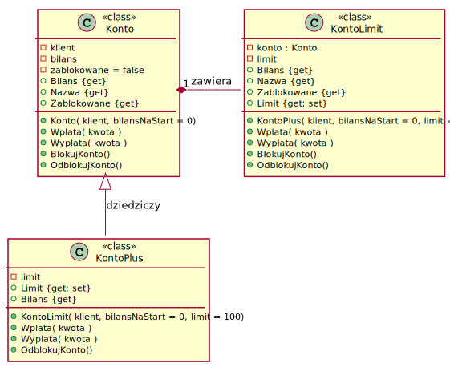

# Lab. Klasa `Konto` w banku, testy jednostkowe

* Opracowanie: _Krzysztof Molenda_
* Wersja: _2018-11-03_

---

Celem ćwiczenia jest:

1. Utworzenie klasy `Konto` o podstawowej funkcjonalności. Opracowanie testów jednostkowych dla tej klasy.
2. Rozbudowa klasy `Konto` o dodatkowe funkcjonalności z wykorzystaniem mechanizmów dziedziczenia oraz delegacji i opracowanie odpowiednich testów jednostkowych.

## Polecenia krok po kroku

Przed rozpoczęciem ćwiczenia zapoznaj się opracowaniem [Unit test basics](https://docs.microsoft.com/en-US/visualstudio/test/unit-test-basics). W szczególności - zrealizuj zamieszczone tam podobne ćwiczenie (_krok po kroku_): _The MyBank solution example_. Dowiesz się, w jaki sposób należy budować testy jednostkowe w środowisku _MSTest v2_.

### Krok 1

> Pełne wsparcie dla procesów testowania dostarcza Visual Studio w wersji _Enterprise_ (np. _Live testing_, _Microsoft Fakes_).

1. Utwórz _solution_ o nazwie _Bank_.

2. W ramach _solution_ utwórz projekt typu _Class Library_ o nazwie _Bank_.

3. W projekcie tym utwórz publiczną klasę `Konto`.

4. Przyjmij, że polami są:

    ```csharp
    private string klient;  //nazwa klienta
    private decimal bilans;  //aktualny stan środków na koncie
    private bool zablokowane = false; //stan konta
    ```

5. Utwórz konstruktor domyślny, który nic nie robi (pusty), ale prywatny. Dzięki temu nie będzie można utworzyć konta bez podania nazwy klienta.

6. Utwórz konstruktor dwuargumentowy:

    ```csharp
    public Konto(string klient, decimal bilansNaStart = 0)
    ```

    inicjujący pola obiektu.

    W sumie ten pierwszy konstruktor nie będzie Ci już potrzebny i możesz go usunąć (dlaczego?).

7. Utwórz _properties_ typu read-only, za pomocą których odczytasz nazwę klienta (`Nazwa`) oraz aktualny bilans (`Bilans`) jak również aktualny status konta (czy jest zablokowane, czy nie).

8. Opracuj metodę `void Wplata(decimal kwota)`, która zasila stan środków konta. Rozważ różne sytuacje, zgłaszając wyjątki w sytuacjach niewłaściwych.

9. Opracuj metodę `void Wyplata(decimal kwota)`, która zmniejsza stan środków konta. Rozważ różne sytuacje, zgłaszając wyjątki. Pamiętaj, że nie można dokonać wypłaty z konta, jeśli nie ma na nim odpowiedniej ilości środków.

10. Napisz metody `void BlokujKonto()` oraz `void OdblokujKonto()`, zmieniające stan pola `zablokowane`.

11. **Opracuj testy jednostkowe dla metod klasy `Konto`**.

12. Przyjmij, że na koncie, które jest zablokowane nie można wykonywać żadnych operacji (wpłata/wypłata). Skoryguj kod poprzednio opracowanych metod.

13. **Sprawdź, jak zachowują się testy jednostkowe. Skoryguj je.**

---

### Krok 2

1. Rozbuduj kod, wprowadzając następującą funkcjonalność - `KontoPlus`:

    > * "Jednorazowy limit debetowy", ustalany indywidualnie podczas tworzenia konta, z możliwością zmiany dla już istniejącego konta (zwiększenie lub zmniejszenie).
    > * Umożliwia on **jednorazowe** zrealizowanie wypłaty przekraczającej aktualny stan środków (tzw. debet), ale nie przekraczającej kwoty ustalonego "jednorazowego limitu debetowego".
    > * Po wykonaniu takiej transakcji konto zostaje zablokowane.
    > * Konto zostanie odblokowane po wykonaniu wpłaty (wpłat), które podniosą stan środków powyżej `0`. Przywrócona zostanie wtedy również funkcjonalność "jednorazowego limitu debetowego".

2. Zadanie to zrealizuj, tworząc klasę `KontoPlus`, dziedziczącą z klasy `Konto`.

3. Musisz dodać mechanizmy obsługi koncepcji "jednorazowego limitu debetowego" oraz wystąpienia takiego debetu, zmodyfikować konstruktor, metody `Wplata` oraz `Wyplata`. Zmodyfikuj _property_ `Bilans`, zwracający stan konta z uwzględnieniem jednorazowego limitu debetowego (formalnie, są to środki pieniężne do dyspozycji klienta). Pamiętaj o hermetyzacji.

4. **Opracuj testy jednostkowe dla `KontoPlus`**.

---

### Krok 3

1. Rozbuduj kod, tworząc klasę `KontoLimit`, o tej samej funkcjonalności co `KontoPlus`, ale tym razem nie wykorzystując mechanizmu dziedziczenia, a [delegację](http://best-practice-software-engineering.ifs.tuwien.ac.at/patterns/delegation.html):

   * Klasa `KontoLimit` zawiera prywatny obiekt typu `Konto` oraz pole `limit`, określające wartość jednorazowego limitu debetowego

   * Dla klasy `KontoLimit` musisz utworzyć konstruktor, tworzący obiekt typu `Konto` oraz inicjujący `limit`, jak również zaprogramować stosowne metody do obsługi takiego konta (o funkcjonalności identycznej z `KontoPlus`).

    Pamiętaj o hermetyzacji.

2. **Opracuj testy jednostkowe dla publicznych właściwości i metod tej klasy.**

---

Uproszczony diagram klas UML do omawianego problemu:



---

### Krok 4

W projekcie konsolowym zasymuluj działanie opracowanych kont - w `Main()` napisz sekwencję operacji.

---

## Krok 5

Zastanów się nad realizacją (w kodzie) następującego scenariusza:

1. Użytkownik ma założone `Konto`

   ```csharp
   molenda = new Konto("Molenda", 100);
   ```

2. Użytkownik decyduje się na zmianę tego konta na `KontoPlus`. Jakim kodem można to zrealizować?

3. Użytkownik `KontoPlus` chce wrócić do `Konto` (rezygnuje z jednorazowego limitu debetowego). Jakim kodem to można zrealizować?

4. Zaproponuj modyfikacje kodu (architektury biblioteki klas) tak, aby te "konwersje" były łatwo programowalne dla programistów wykorzystujących Twoją bibliotekę klas `Bank` we własnych projektach.

5. Zastanów się nad analogicznym scenariuszem dla `KontoLimit`.

Podpowiedzi: a może jakiś interfejsik, rzutowanie, ...
